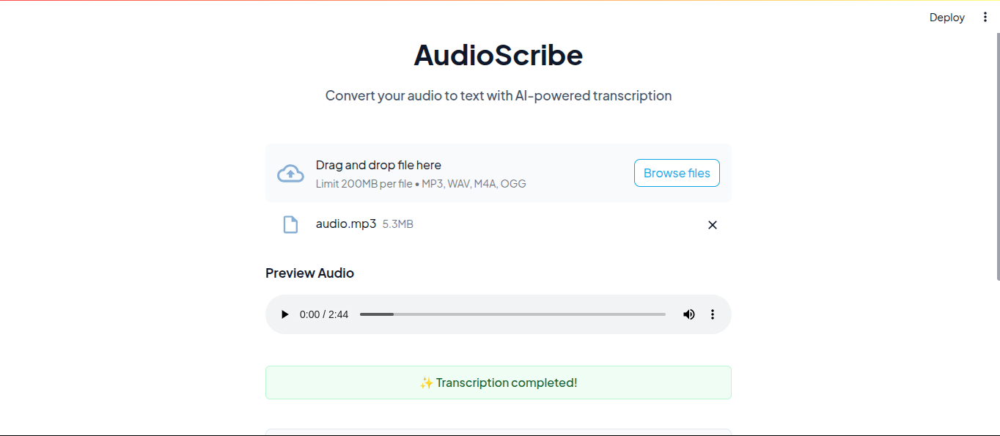

# 🎙️ AudioScribe

<div align="center">

**Transform your audio into text with AI-powered transcription**

[](https://www.python.org/downloads/)
[](https://streamlit.io)
[](https://github.com/openai/whisper)
[](LICENSE)

</div>

## 📸 Screenshots

### Upload Screen


*Clean and intuitive interface for audio file upload*

### Transcription Result


*Real-time transcription with audio preview and download options*

## ✨ Features

- 🎯 **High-Accuracy Transcription** using OpenAI's Whisper model
- 🎵 **Multiple Audio Formats** support (MP3, WAV, M4A, OGG)
- 🎧 **Built-in Audio Player** for preview
- 💾 **Instant Download** of transcription results
- 🎨 **Modern, Clean UI** for the best user experience

## 🚀 Quick Start

### Prerequisites

- Python 3.8 or higher
- FFmpeg (required for audio processing)

### Installation

1. Clone the repository:
```bash
git clone https://github.com/yourusername/AudioScribe.git
cd AudioScribe
```

2. Install required packages:
```bash
pip install -r requirements.txt
```

3. Run the application:
```bash
streamlit run main.py
```

The app will be available at `http://localhost:8501`

## 💡 Usage

1. **Upload Audio**
   - Click the upload area or drag and drop your audio file
   - Supported formats: MP3, WAV, M4A, OGG
   - Maximum file size: 200MB

2. **Preview Audio** (Optional)
   - Use the built-in audio player to verify your upload
   - Check the audio quality before transcription

3. **Get Transcription**
   - Wait for the AI model to process your audio
   - View the transcribed text in real-time
   - Download the results as a text file

## 🛠️ Tech Stack

- **Frontend**: [Streamlit](https://streamlit.io)
- **AI Model**: [OpenAI Whisper](https://github.com/openai/whisper)
- **Audio Processing**: [FFmpeg](https://ffmpeg.org)
- **Python Libraries**:
  - `streamlit`: Web application framework
  - `whisper`: AI transcription model
  - `tempfile`: Temporary file handling
  - `datetime`: Timestamp generation

## 📝 License

This project is licensed under the MIT License - see the [LICENSE](LICENSE) file for details.

## 🤝 Contributing

Contributions are welcome! Please feel free to submit a Pull Request.

1. Fork the repository
2. Create your feature branch (`git checkout -b feature/AmazingFeature`)
3. Commit your changes (`git commit -m 'Add some AmazingFeature'`)
4. Push to the branch (`git push origin feature/AmazingFeature`)
5. Open a Pull Request

## 📬 Contact

Your Name - [@website](https://waghib.github.io) - waghibahmad30@gmail.com

Project Link: [https://github.com/Waghib/WhisperAI-Speech-Recognition](https://github.com/Waghib/WhisperAI-Speech-Recognition)

---

<div align="center">
Made with ❤️ using OpenAI Whisper and Streamlit
</div>
